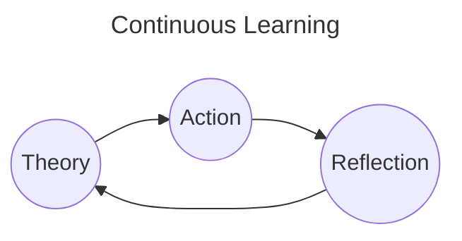

# Schedule

# 2023

## BackLogs
- [x] CKAD Cerfiication
- [ ] CloudPractioner Udemy Course
- [ ] Terraform

## Tasks

#### Dec-14
- [ ] [Udemy] [CloudPractioner] Lesson 193 - 200

#### Dec-15
- [ ] [Udemy] [CloudPractioner] Lesson 201 - 212

#### Dec-16
- [ ] [Udemy] [CloudPractioner] Lesson 213 - 216

#### Dec-17
- [ ] [Udemy] [CloudPractioner] Lesson 217 - 232

#### Dec-18
- [ ] [Udemy] [CloudPractioner] Lesson 233 - 256

#### Dec-19
- [ ] [Udemy] [CloudPractioner] Lesson 257 - 270

#### Dec-20
- [ ] [Udemy] [CloudPractioner] Lesson 271 - 281

# 2024

## BackLogs
- [ ] AWS Developer Associate Certification
- [ ] Design pattern book
- [ ] Revamp base
- [ ] Database
- [ ] Stocks 
