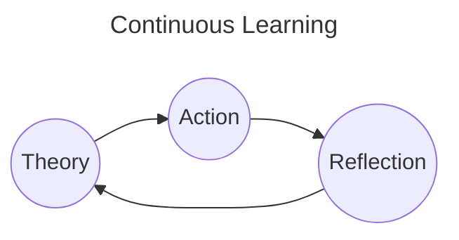

# Schedule

# 2024

## BackLogs

- [x] Socket.io
- [ ] Time-series DB
- [ ] WAF
- [ ] Deep dive into [SQLAlchemy Query Guide](https://docs.sqlalchemy.org/en/20/orm/queryguide/index.html)
- [ ] Terraform (Jan/08 - Jan/31)
- [ ] Design Pattern book
- [ ] Refactor fastapi-orm-helper
- [ ] AWS Developer Associate Certification
- [ ] AWS DevOps Engineer Professional
- [ ] Database
  - [ ] Revamp SQL queries
  - [ ] Query Plan
  - [x] Transaction
  - [x] Locking
  - [ ] Sharding
  - [ ] Partitioning
- [ ] Research Microservice Transactions
  - [ ] 2 phases commits
  - [ ] outbox transaction
  - [ ] saga pattern
- [ ] Read 1 microservice book
- [ ] Revamp Computer Science Base
- [ ] Document the renyoo media-handler service by drawing the chart
- [ ] Refactor sns hook: SnsHandlerFactory

## Tasks

### Done

#### Jan-01

- [x] Research **socket.io** again

### Jan-02

- [x] Make docs for time-series database resesarch

### Jan-06

- [x] Document Database Transactions
- [x] Document Database Locking

### Jan-07

- [ ] Make docs for WAF research
- [ ] Investigate InfluxDB, TimescaleDB, DruidDB

### Jan-08

- [ ] [Terraform] Learn terraform

---

# 2023

## BackLogs

- [x] CKAD Certification
- [x] CloudPractioner Udemy Course

## Tasks

### Done

#### Dec-14

- [x] [Udemy] [CloudPractioner] Lesson 193 - 200

#### Dec-15

- [x] [Udemy] [CloudPractioner] Lesson 201 - 212

#### Dec-16

- [x] [Udemy] [CloudPractioner] Lesson 213 - 216

#### Dec-17

- [x] [Udemy] [CloudPractioner] Lesson 217 - 232
- [ ] Research Ansible

#### Dec-18

- [x] [Udemy] [CloudPractioner] Lesson 233 - 237

#### Dec-19

- [x] [Udemy] [CloudPractioner] Lesson 237 - 257

#### Dec-20, 21

- [x] [Udemy] [CloudPractioner] Lesson 257 - 281
