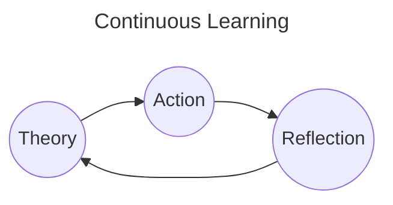

# Schedule

# 2024

## BackLogs

*High priority tasks*:

- [ ] Fix SNS subscription issues
- [ ] Fix socket issues
- [ ] Setup deployment for dev
- [ ] Setup deployment for client-org env
- [ ] Write deployment docs
- [ ] Prepare migration, setup env for client-org 
- [ ] Refactor helm chart templates
- [ ] Write tasks description for sprint 20

---
*Medium priority tasks*:

- [x] Socket.io
- [x] Web Development Architecture
- [x] Time-series DB (TimescaleDB extension)
- [x] WAF
- [x] SqlAlchemy
  - [x] Transaction
  - [ ] [SQLAlchemy Query Guide](https://docs.sqlalchemy.org/en/20/orm/queryguide/index.html)
- [ ] Terraform (Feb/01 - Feb/31)
- [ ] Design Pattern book
- [ ] Database
  - [x] Revamp SQL queries
  - [ ] Query Plan
  - [x] Transaction
  - [x] Locking
  - [ ] Sharding
  - [ ] Partitioning
- [ ] Refactor fastapi-orm-helper
- [ ] AWS Developer Associate Certification
- [ ] AWS DevOps Engineer Professional
- [ ] Research Microservice Transactions
  - [ ] 2 phases commits
  - [ ] outbox transaction
  - [ ] saga pattern
- [ ] Read 1 microservice book

---
*Low priority tasks*:

- [ ] Revamp Computer Science Base
- [ ] Refactor sns hook: SnsHandlerFactory
- [ ] Document the renyoo media-handler service by drawing the chart

## Tasks

### Done

#### Jan-24, 25, 26 until Feb-07

- [x] Setup deployment for microservice

#### Jan-23

- [x] Move migration migrate data to command
- [x] Review API changed docs, merge refactor into microservice branch
- [ ] Setup deployment for microservice

#### Jan-22

- [x] Finish task tracking time spent
- [x] Fix sprint bugs
  - [x] Calculate file size
  - [x] Count unique view
  - [x] Decrement view when delete attachments

#### Jan-08

- [x] [WAF] WAF rate-limit proposal
- [x] [SQLAlchemy] SQLAlchemy Transaction
- [ ] [Terraform] Learn terraform

#### Jan-07

- [x] [Web Development Architecture] CSR vs SSR
- [x] [Web Development Architecture] MVC
- [x] [Socket] Socket event emitter, adapter

#### Jan-06

- [x] [Database] Document Database Transactions
- [x] [Database] Document Database Locking

#### Jan-02

- [x] [Time-series DB] Make docs for time-series database resesarch

#### Jan-01

- [x] [Socket] Research **socket.io** again

---

# 2023

## BackLogs

- [x] CKAD Certification
- [x] CloudPractioner Udemy Course

## Tasks

### Done

#### Dec-14

- [x] [Udemy] [CloudPractioner] Lesson 193 - 200

#### Dec-15

- [x] [Udemy] [CloudPractioner] Lesson 201 - 212

#### Dec-16

- [x] [Udemy] [CloudPractioner] Lesson 213 - 216

#### Dec-17

- [x] [Udemy] [CloudPractioner] Lesson 217 - 232
- [ ] Research Ansible

#### Dec-18

- [x] [Udemy] [CloudPractioner] Lesson 233 - 237

#### Dec-19

- [x] [Udemy] [CloudPractioner] Lesson 237 - 257

#### Dec-20, 21

- [x] [Udemy] [CloudPractioner] Lesson 257 - 281
