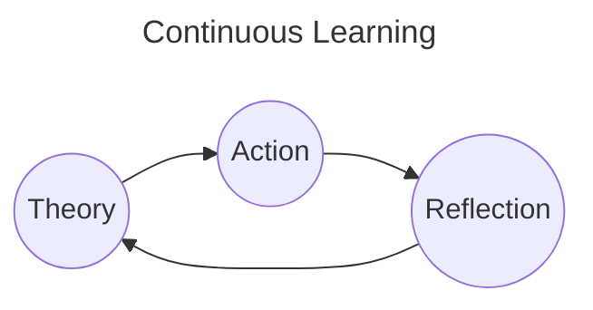

# Schedule

# 2023

## BackLogs

- [x] CKAD Cerfiication
- [x] CloudPractioner Udemy Course
- [ ] Terraform

## Tasks

#### Dec-14

- [x] [Udemy] [CloudPractioner] Lesson 193 - 200

#### Dec-15

- [x] [Udemy] [CloudPractioner] Lesson 201 - 212

#### Dec-16

- [x] [Udemy] [CloudPractioner] Lesson 213 - 216

#### Dec-17

- [x] [Udemy] [CloudPractioner] Lesson 217 - 232
- [ ] Research Ansible

#### Dec-18

- [x] [Udemy] [CloudPractioner] Lesson 233 - 237

#### Dec-19

- [x] [Udemy] [CloudPractioner] Lesson 237 - 257

#### Dec-20, 21

- [x] [Udemy] [CloudPractioner] Lesson 257 - 281

# 2024

## BackLogs

- [ ] AWS Developer Associate Certification
- [ ] AWS DevOps Engineer Professional
- [ ] Design pattern book
- [ ] Revamp base
- [ ] Database
- [ ] Stocks
