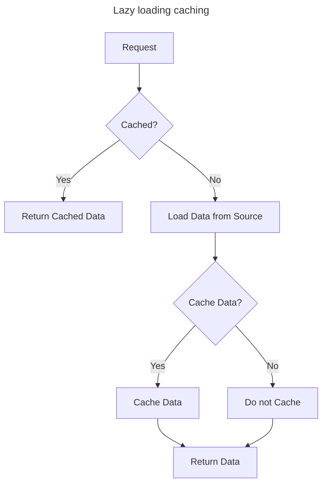
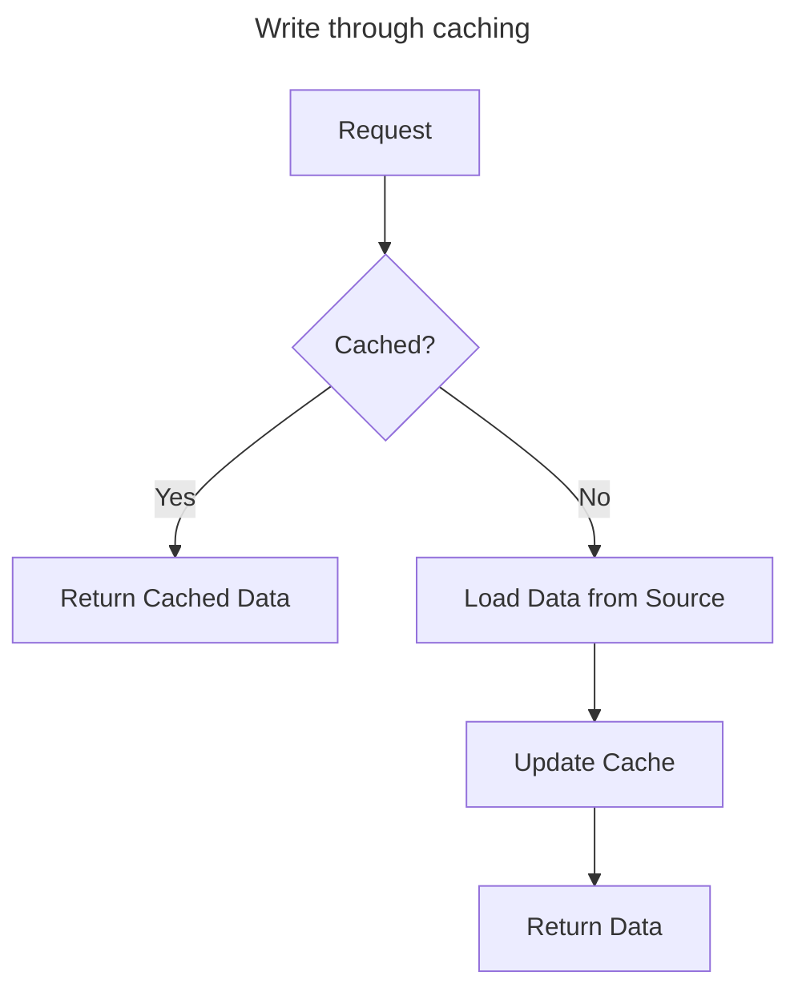

# Caching Strategies

<!-- published_date: 27 Mar, 2024 -->
<!-- description: caching strategies -->
<!-- tags: redis, caching -->

### 1. Lazy Loading / Cache-aside / Lazy population




Pros:
- Only requested data is cached (the cache isn't filled up with unused data)
- Node failures are not fatal (just increase the latency to warm the cache)

Cons:
- Cache misses penalty that result 3 round trips, noticable delay for that request
- Stale data: data can be updated in the database and outdated in the cache


```python
class LazyLoadingCache:
    def __init__(self):
        self.cache = Cache()
        self.data_source = DataSource()

    def get_data(self, key):
        cached_data = self.cache.get_data(key)
        if cached_data is not None:
            return cached_data
        else:
            data = self.data_source.load_data(key)
            self.cache.cache_data(key, data)
            return data
```

### 2. Write Through - Add or update cache when database is updated



Pros:
- Cache is always up-to-date
- No round trips to the database
- Stale data: data can be updated in the database and outdated in the cache
- Write penalty vs Read penalty (each write requires 2 calls)

Cons:
- Missing data until it is added / updated in to database. Mitigation is to implement Lazy Loading strategy as well
- Cache churn, a lot of data will never be read


```python

def save_user(user_id, values):
    record = query_in_db()

    cache.set(user_id, record)

    return record

user = save_user(1, {'name': 'Harry', 'age': 25})
```

### 3. Cache Eviction and Time to live (TTL)

- Caching evitions can occur in 3 ways:
  1. Eviction based on TTL
  2. We delete them explicitly in the cache
  3. Because of memory is full and not recent used (LRU)

*Quote: There are only 2 hard things in Computer Science: cache invalidation and naming things.* 
