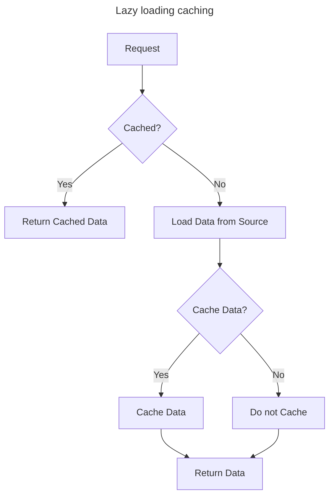
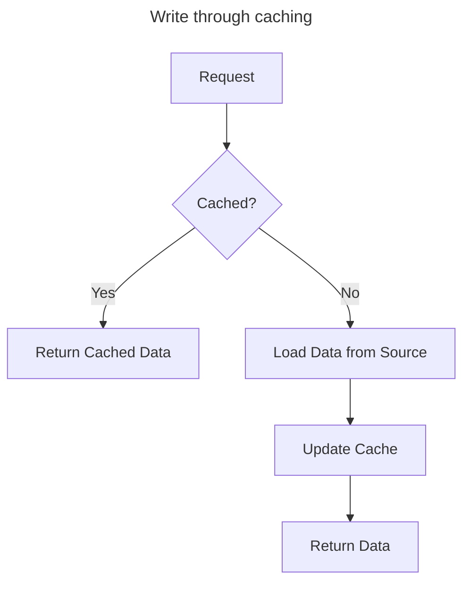

Reference: https://neetcode.io/courses/system-design-for-beginners/10

## The client's perspective
When a browser needs to load a resource, such as an image file, it follows a sequence of steps to determine where to get the file:

Check the Memory Cache: The browser first checks its memory cache. This is used for resources downloaded in the current browsing sessions (since memory is non-persistent).
Check the Disk Cache: If the resource isn't in the memory cache, the browser checks the disk cache, a more persistent cache that contains resources from sites visited in the past.
Network Request: If the resource isn't in either the memory or disk, the browser makes a network request to the server hosting the resource.

## The server's perspective

### 1. Write around / Lazy Loading / Cache-aside / Lazy population



```mermaid
---
title: Lazy loading caching
---
graph TD
    A[Request] --> B{Cached?}
    B -- Yes --> C[Return Cached Data]
    B -- No --> D[Load Data from Source]
    D --> E{Cache Data?}
    E -- Yes --> F[Cache Data]
    E -- No --> G[Do not Cache]
    F --> H[Return Data]
    G --> H
```

Pros:
- Only requested data is cached (the cache isn't filled up with unused data)
- Node failures are not fatal (just increase the latency to warm the cache)

Cons:
- Cache misses penalty that result 3 round trips, noticable delay for that request
- Stale data: data can be updated in the database and outdated in the cache


```python
class LazyLoadingCache:
    def __init__(self):
        self.cache = Cache()
        self.data_source = DataSource()

    def get_data(self, key):
        cached_data = self.cache.get_data(key)
        if cached_data is not None:
            return cached_data
        else:
            data = self.data_source.load_data(key)
            self.cache.cache_data(key, data)
            return data
```

### 2. Write Through - Add or update cache when database is updated


```mermaid
---
title: Write through caching
---
graph TD
    A[Request] --> B{Cached?}
    B -- Yes --> C[Return Cached Data]
    B -- No --> D[Load Data from Source]
    D --> F[Update Cache]
    F --> H[Return Data]
```

Pros:
- Cache is always up-to-date
- No round trips to the database
- Stale data: data can be updated in the database and outdated in the cache
- Write penalty vs Read penalty (each write requires 2 calls)

Cons:
- Missing data until it is added / updated in to database. Mitigation is to implement Lazy Loading strategy as well
- Cache churn, a lot of data will never be read


```python

def save_user(user_id, values):
    record = query_in_db()

    cache.set(user_id, record)

    return record

user = save_user(1, {'name': 'Harry', 'age': 25})
```

### 3. Write-back cache
A write-back cache policy will write data only to the cache initially.
This data is written into the cache every time a change occurs but to the disk only when the cache is full.
The cached data can be written to the disk when the system is less busy.

## Eviction Policies
An eviction policy is a system that determines which items get removed from the cache when the cache is full and new items need to be added. Since the cache size is limited, the system has to decide what to evict from the cache. There are a couple of eviction policies that are important to discuss:

### 1. Time to live (TTL)

### 2. FIFO (First In First Out)
One example of an eviction policy is First In First Out (FIFO). The FIFO policy is similar to the queue interface. When the cache becomes full, the first piece of data to be cached is evicted first.

### 3. LRU (Least Recently Used)
Imagine doing spring cleaning, where your aim is to get rid of the least recently used items such as clothing and office supplies. The concept of the Least Recently Used (LRU) cache is based on the same idea. The principle behind LRU caching is that if an item has not been accessed for a long time, it is less likely to be accessed in the future as well. Therefore, the item should be evicted from the cache. LRU caching would be particularly useful if there were a single person with a really popular tweet, as we wouldn't want that tweet to be removed from our cache.

### 4. LFU (Least Frequently Used)
This one might make more sense now that we understand LRU. Least Frequently Used (LFU) eviction policy evicts the items that are used least frequently. It assumes that if an item is not accessed frequently, it is unlikely to be accessed frequently in the future as well.
In terms of implementation, LFU can be implemented using key-value pairs, where the key represents the item and the value represents the frequency of its usage. When the cache space runs out, the item with the smallest frequency is evicted.
While this approach seems reasonable, it has limitations when applied to Twitter. For example, tweets from 2013 that have a large number of views might never be evicted due to their frequency, which would prevent new tweets from being stored. Consequently, LRU is a better model for Twitter.
