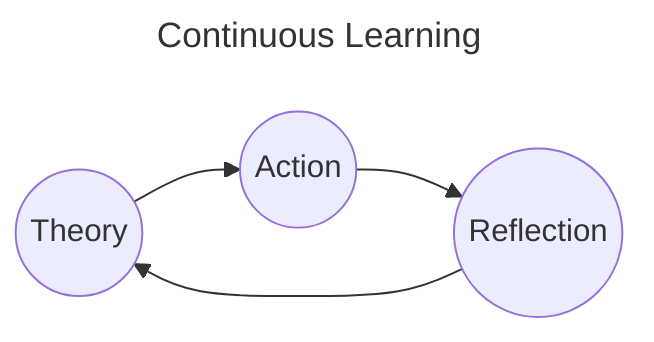

# Schedule

# 2024

- [x] Socket.io
- [x] Web Development Architecture
- [x] Time-series DB (TimescaleDB extension)
- [x] WAF
- [x] ArgoCD
- [x] Deploy BE & FE application on EKS
- [x] Docker & Kubernetes
- [x] WSGI & ASGI & Webserver
- [x] Enable SSL for Namecheap domain with Nginx Webserver

---

## Ongoing tasks:

- [ ] [Reading] Design Pattern book (Mar-15 / Apr-01)
- [ ] [Learning] AWS Developer Associate Certification (Mar-15 / Apr-15)
- [ ] [Preparing] AWS Developer Associate Certification (Apr-01 / Apr-15)
- [ ] [Porfolio Prooject] Reg SSL for domain

---

## BackLogs

### High priority tasks:

- [ ] [Reading] Design Pattern book
- [ ] [Learning] AWS Developer Associate Certification

---

### Medium priority tasks:

- [ ] [Learning] Terraform
- [ ] [Learning] AWS DevOps Engineer Professional
- [ ] [Work] SqlAlchemy
  - [ ] [Work] Fix fastapi-orm-helper transaction
- [ ] [Learning] Database
  - [x] [Learning] Revamp SQL queries
  - [ ] [Learning] Query Plan
  - [x] [Learning] Transaction
  - [x] [Learning] Locking
  - [ ] [Learning] Sharding
  - [ ] [Learning] Partitioning
- [ ] [Learning] Research Microservice Transactions
  - [ ] [Learning] 2 phases commits
  - [ ] [Learning] outbox transaction
  - [ ] [Learning] saga pattern
- [ ] [Reading] Read 1 microservice book

---

### Low priority tasks:

- [ ] [Learning] Revamp Computer Science Base
- [ ] [Work] Refactor fastapi-orm-helper
- [ ] [Work] Refactor sns hook: SnsHandlerFactory
- [ ] [Work] Document the renyoo media-handler service by drawing the chart
- [ ] [Portfolio] Reg SSL for domain
- [ ] [Portfolio] Clone not done tasks of yesterday to next day

---

## Tasks

#### Apr-15

- [ ] [Exam] Take the exam

#### Apr-14

- [ ] [Learning] (Section 33 - 34) Prepare for the exam

#### Apr-13

- [ ] [Learning] (Section 31 - 32) AWS Other Services, Final Cleanup

#### Apr-12

- [ ] [Learning] (Section 30) AWS Security & Encryption

#### Apr-11

- [ ] [Learning] (Section 28 - 29) Other Serverless: Step Functions & App Sync, Advanced Identity

#### Apr-10

- [ ] [Learning] (Section 25 - 26 - 27) AWS SAM: Serverless Application Model & CDK & Cognito

#### Apr-09

- [ ] [Learning] (Section 24) AWS CI/CD: CodeCommmit, CodeBuild, CodeDeploy, CodePipeline

#### Apr-08

- [ ] [Learning] (Section 23) AWS Serverless: API Gateway

#### Apr-07

- [ ] [Learning] (Section 22) AWS Serverless: DynamoDB

#### Apr-06

- [ ] [Learning] (Section 21) AWS Serverless: Lambda

#### Apr-05

- [ ] [Learning] (Section 20) AWS Mornitor & Audit: CloudTrail & CloudWatch, X-Ray

#### Apr-04

- [ ] [Learning] (Section 19) AWS Integration & Messaging: SQS, SNS & Kinesis

#### Apr-03

- [ ] [Learning] (Section 18) Cloudformation

#### Apr-02

- [ ] [Learning] (Section 17) AWS Elastic Beanstalk

#### Apr-01

- [ ] [Learning] (Section 16) ECS & ECR & Fargate & Docker in AWS

#### Mar-31

- [ ] [Learning] (Section 15) Cloudfront

#### Mar-30

- [ ] [Learning] (Section 13 - 14) Advanced S3 & S3 Security

#### Mar-29

- [ ] [Reading] Design Pattern
- [ ] [Learning] (Section 12) AWS CLI & SDK & IAM Roles & Policies

#### Mar-28

- [ ] [Reading] SOLID
- [ ] [Learning] (Section 10 - 11) VPC & S3

#### Mar-27

- [ ] [Learning] (Section 9) Route 53

#### Mar-26

- [x] [Learning] (Section 8) RDS & Aurora & Elasticache

#### Mar-25

- [x] [Learning] (Section 7) ELB & ASG

#### Mar-24

- [x] [Reading] OOP
- [x] [Learning] (Section 6) EC2 Instance Storage

#### Mar-23

- [ ] [Reading] OOP
- [ ] [Learning] (Section 6) EC2 Instance Storage
- [x] [Work] Fix test

#### Mar-22

- [ ] [Reading] (Section 1) Design Pattern book
- [ ] [Learning] (Section 6) EC2 Instance Storage

#### Mar-21

- [ ] [Reading] (Section 1) Design Pattern book
- [ ] [Learning] (Section 6) EC2 Instance Storage

#### Mar-20

- [ ] [Reading] (Section 1) Design Pattern book
- [x] [Learning] (Section 5) IAM & AWS CLI & EC2

#### Mar-19

- [ ] [Reading] (Section 1) Design Pattern book
- [ ] [Learning] (Section 1 - 4) IAM & AWS CLI & EC2
- [x] [Porfolio Prooject] Refactor codes & setup CI/CD

#### Mar-18

- [ ] [Reading] (Section 1) Design Pattern book
- [ ] [Learning] (Section 1 - 4) IAM & AWS CLI & EC2
- [x] [Side-project] Build Task page

#### Mar-17

- [ ] [Reading] (Section 1) Design Pattern book
- [ ] [Learning] (Section 1 - 4) IAM & AWS CLI & EC2
- [x] [Side-project] Create schedule-task-notification slack bot

#### Mar-16

- [ ] [Reading] (Section 1) Design Pattern book
- [ ] [Learning] (Section 1 - 4) IAM & AWS CLI & EC2

#### Mar-15

- [x] [Learning] Finish Docker & Kubernetes course on Udemy
- [ ] [Learning] (Section 1 - 4) IAM & AWS CLI & EC2

#### Mar-07

- [x] [Work] Update deployment docs

#### Mar-06

- [x] [Work] Generate subdomain dynamically

#### Mar-05

- [x] [Work] Move UAT to new infra
- [x] [Work] Setup Rotex env

#### Mar-03, Mar-04

- [x] [Work] Refactor helm chart templates
- [ ] [Work] Update deployment docs

#### Mar-02

- [x] Research chainguard-images, dagger, OCI images
- [x] Setup client-org env

#### Mar-01

- [x] Implement Admin Guard

#### Feb-24, 25

- [x] Write deployment docs

#### Tet holiday

- [x] Fix SNS subscription issues
- [x] Fix socket issues
- [x] Setup deployment for dev
- [x] Setup deployment for client-org env
- [x] Prepare migration, setup env for client-org

#### Jan-24, 25, 26 until Feb-07

- [x] Setup deployment for microservice

#### Jan-23

- [x] Move migration migrate data to command
- [x] Review API changed docs, merge refactor into microservice branch
- [ ] Setup deployment for microservice

#### Jan-22

- [x] Finish task tracking time spent
- [x] Fix sprint bugs
  - [x] Calculate file size
  - [x] Count unique view
  - [x] Decrement view when delete attachments

#### Jan-08

- [x] [WAF] WAF rate-limit proposal
- [x] [SQLAlchemy] SQLAlchemy Transaction
- [ ] [Terraform] Learn terraform

#### Jan-07

- [x] [Web Development Architecture] CSR vs SSR
- [x] [Web Development Architecture] MVC
- [x] [Socket] Socket event emitter, adapter

#### Jan-06

- [x] [Database] Document Database Transactions
- [x] [Database] Document Database Locking

#### Jan-02

- [x] [Time-series DB] Make docs for time-series database research

#### Jan-01

- [x] [Socket] Research **socket.io** again

---

# 2023

## BackLogs

- [x] CKAD Certification
- [x] CloudPractioner Udemy Course

## Tasks

### Done

#### Dec-14

- [x] [Udemy] [CloudPractioner] Lesson 193 - 200

#### Dec-15

- [x] [Udemy] [CloudPractioner] Lesson 201 - 212

#### Dec-16

- [x] [Udemy] [CloudPractioner] Lesson 213 - 216

#### Dec-17

- [x] [Udemy] [CloudPractioner] Lesson 217 - 232
- [ ] Research Ansible

#### Dec-18

- [x] [Udemy] [CloudPractioner] Lesson 233 - 237

#### Dec-19

- [x] [Udemy] [CloudPractioner] Lesson 237 - 257

#### Dec-20, 21

- [x] [Udemy] [CloudPractioner] Lesson 257 - 281

