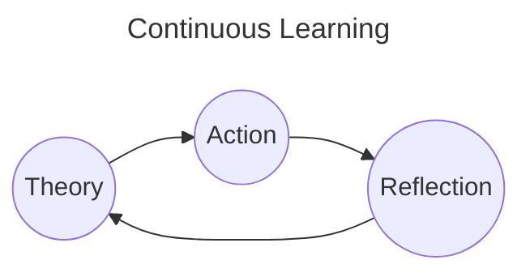

# Schedule

# 2024

- [x] Socket.io
- [x] Web Development Architecture
- [x] Time-series DB (TimescaleDB extension)
- [x] WAF
- [x] ArgoCD
- [x] Deploy BE & FE application on EKS
- [x] Docker & Kubernetes

---

## Ongoing tasks:

- [ ] [Reading] Design Pattern book (Mar-15 / Apr-01)
- [ ] [Learning] AWS Developer Associate Certification (Mar-15 / Apr-15)
- [ ] [Preparing] AWS Developer Associate Certification (Apr-01 / Apr-15)

---

## BackLogs

### High priority tasks:

- [ ] [Work] Fix bug
- [x] [Side-project] Build Note pages

---

### Medium priority tasks:

- [ ] [Learning] Terraform
- [ ] [Learning] AWS DevOps Engineer Professional
- [ ] [Work] SqlAlchemy
  - [ ] [Work] Fix fastapi-orm-helper transaction
- [ ] [Learning] Database
  - [x] [Learning] Revamp SQL queries
  - [ ] [Learning] Query Plan
  - [x] [Learning] Transaction
  - [x] [Learning] Locking
  - [ ] [Learning] Sharding
  - [ ] [Learning] Partitioning
- [ ] [Learning] Research Microservice Transactions
  - [ ] [Learning] 2 phases commits
  - [ ] [Learning] outbox transaction
  - [ ] [Learning] saga pattern
- [ ] [Reading] Read 1 microservice book

---

### Low priority tasks:

- [ ] [Learning] Revamp Computer Science Base
- [ ] [Work] Refactor fastapi-orm-helper
- [ ] [Work] Refactor sns hook: SnsHandlerFactory
- [ ] [Work] Document the renyoo media-handler service by drawing the chart

## Tasks

#### Mar-18

- [ ] [Reading] (Section 1) Design Pattern book
- [ ] [Learning] (Section 1 - 4) AWS Developer Associate Certification
- [x] [Side-project] Build Task page

#### Mar-17

- [ ] [Reading] (Section 1) Design Pattern book
- [ ] [Learning] (Section 1 - 4) AWS Developer Associate Certification
- [x] [Side-project] Create schedule-task-notification slack bot

#### Mar-16

- [ ] [Reading] (Section 1) Design Pattern book
- [ ] [Learning] (Section 1 - 4) AWS Developer Associate Certification

#### Mar-15

- [x] [Learning] Finish Docker & Kubernetes course on Udemy
- [ ] [Learning] (Section 1 - 4) AWS Developer Associate Certification

#### Mar-07

- [x] [Work] Update deployment docs

#### Mar-06

- [x] [Work] Generate subdomain dynamically

#### Mar-05

- [x] [Work] Move UAT to new infra
- [x] [Work] Setup Rotex env

#### Mar-03, Mar-04

- [x] [Work] Refactor helm chart templates
- [ ] [Work] Update deployment docs

#### Mar-02

- [x] Research chainguard-images, dagger, OCI images
- [x] Setup client-org env

#### Mar-01

- [x] Implement Admin Guard

#### Feb-24, 25

- [x] Write deployment docs

#### Tet holiday

- [x] Fix SNS subscription issues
- [x] Fix socket issues
- [x] Setup deployment for dev
- [x] Setup deployment for client-org env
- [x] Prepare migration, setup env for client-org

#### Jan-24, 25, 26 until Feb-07

- [x] Setup deployment for microservice

#### Jan-23

- [x] Move migration migrate data to command
- [x] Review API changed docs, merge refactor into microservice branch
- [ ] Setup deployment for microservice

#### Jan-22

- [x] Finish task tracking time spent
- [x] Fix sprint bugs
  - [x] Calculate file size
  - [x] Count unique view
  - [x] Decrement view when delete attachments

#### Jan-08

- [x] [WAF] WAF rate-limit proposal
- [x] [SQLAlchemy] SQLAlchemy Transaction
- [ ] [Terraform] Learn terraform

#### Jan-07

- [x] [Web Development Architecture] CSR vs SSR
- [x] [Web Development Architecture] MVC
- [x] [Socket] Socket event emitter, adapter

#### Jan-06

- [x] [Database] Document Database Transactions
- [x] [Database] Document Database Locking

#### Jan-02

- [x] [Time-series DB] Make docs for time-series database research

#### Jan-01

- [x] [Socket] Research **socket.io** again

---

# 2023

## BackLogs

- [x] CKAD Certification
- [x] CloudPractioner Udemy Course

## Tasks

### Done

#### Dec-14

- [x] [Udemy] [CloudPractioner] Lesson 193 - 200

#### Dec-15

- [x] [Udemy] [CloudPractioner] Lesson 201 - 212

#### Dec-16

- [x] [Udemy] [CloudPractioner] Lesson 213 - 216

#### Dec-17

- [x] [Udemy] [CloudPractioner] Lesson 217 - 232
- [ ] Research Ansible

#### Dec-18

- [x] [Udemy] [CloudPractioner] Lesson 233 - 237

#### Dec-19

- [x] [Udemy] [CloudPractioner] Lesson 237 - 257

#### Dec-20, 21

- [x] [Udemy] [CloudPractioner] Lesson 257 - 281

