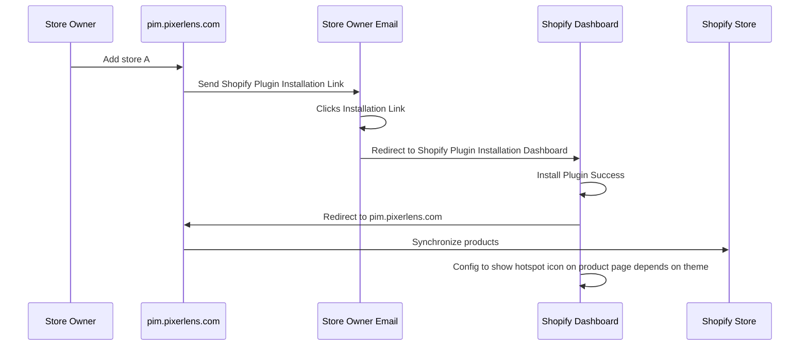
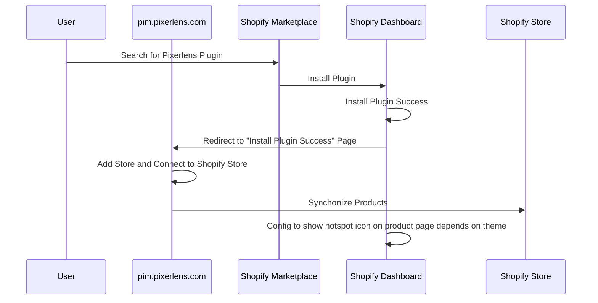
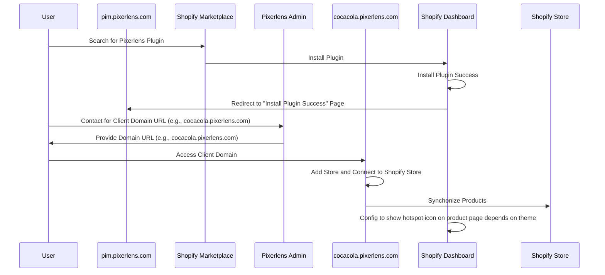

# Flow 1: Start from the client site

```mermaid


sequenceDiagram
    participant Store Owner
    participant pim.pixerlens.com
    participant Store Owner Email
    participant Shopify Dashboard
    participant Shopify Store
    
    Store Owner->>pim.pixerlens.com: Add store A
    pim.pixerlens.com->>Store Owner Email: Send Shopify Plugin Installation Link
    Store Owner Email->>Store Owner Email: Clicks Installation Link
    
    Store Owner Email->>Shopify Dashboard: Redirect to Shopify Plugin Installation Dashboard
    Shopify Dashboard->>Shopify Dashboard: Install Plugin Success
    Shopify Dashboard->>pim.pixerlens.com: Redirect to pim.pixerlens.com

    pim.pixerlens.com->>Shopify Store: Synchronize products
    Shopify Dashboard->>Shopify Dashboard: Config to show hotspot icon on product page depends on theme
```

---

# Flow 2: Install plugin directly on Shopify Marketplace

```mermaid

sequenceDiagram
    participant User
    participant pim.pixerlens.com
    participant Shopify Marketplace
    participant Shopify Dashboard
    participant Shopify Store

    User->>Shopify Marketplace: Search for Pixerlens Plugin
    Shopify Marketplace->>Shopify Dashboard: Install Plugin
    Shopify Dashboard->>Shopify Dashboard: Install Plugin Success
    Shopify Dashboard->>pim.pixerlens.com: Redirect to "Install Plugin Success" Page

    pim.pixerlens.com->>pim.pixerlens.com: Add Store and Connect to Shopify Store
    pim.pixerlens.com->>Shopify Store: Synchonize Products
    Shopify Dashboard->>Shopify Dashboard: Config to show hotspot icon on product page depends on theme
```

# Flow 3: Install plugin directly on Shopify Marketplace (multiple organization)

```mermaid

sequenceDiagram
    participant User
    participant pim.pixerlens.com
    participant Shopify Marketplace
    participant Pixerlens Admin
    participant cocacola.pixerlens.com
    participant Shopify Dashboard
    participant Shopify Store

    User->>Shopify Marketplace: Search for Pixerlens Plugin
    Shopify Marketplace->>Shopify Dashboard: Install Plugin
    Shopify Dashboard->>Shopify Dashboard: Install Plugin Success
    Shopify Dashboard->>pim.pixerlens.com: Redirect to "Install Plugin Success" Page

    User->>Pixerlens Admin: Contact for Client Domain URL (e.g., cocacola.pixerlens.com)
    Pixerlens Admin->>User: Provide Domain URL (e.g., cocacola.pixerlens.com)
    User->>cocacola.pixerlens.com: Access Client Domain
    cocacola.pixerlens.com->>cocacola.pixerlens.com: Add Store and Connect to Shopify Store

    cocacola.pixerlens.com->>Shopify Store: Synchonize Products
    Shopify Dashboard->>Shopify Dashboard: Config to show hotspot icon on product page depends on theme
```

